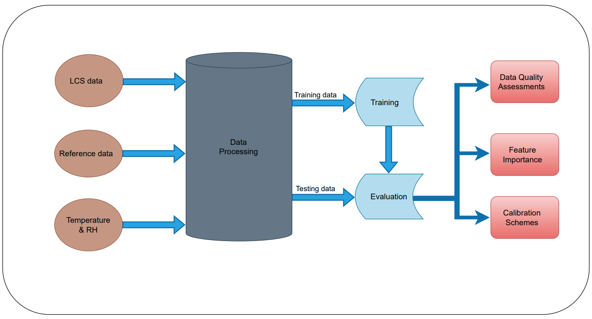
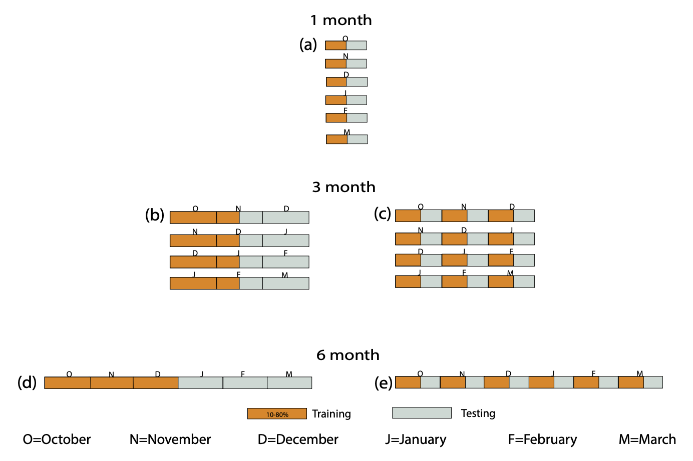
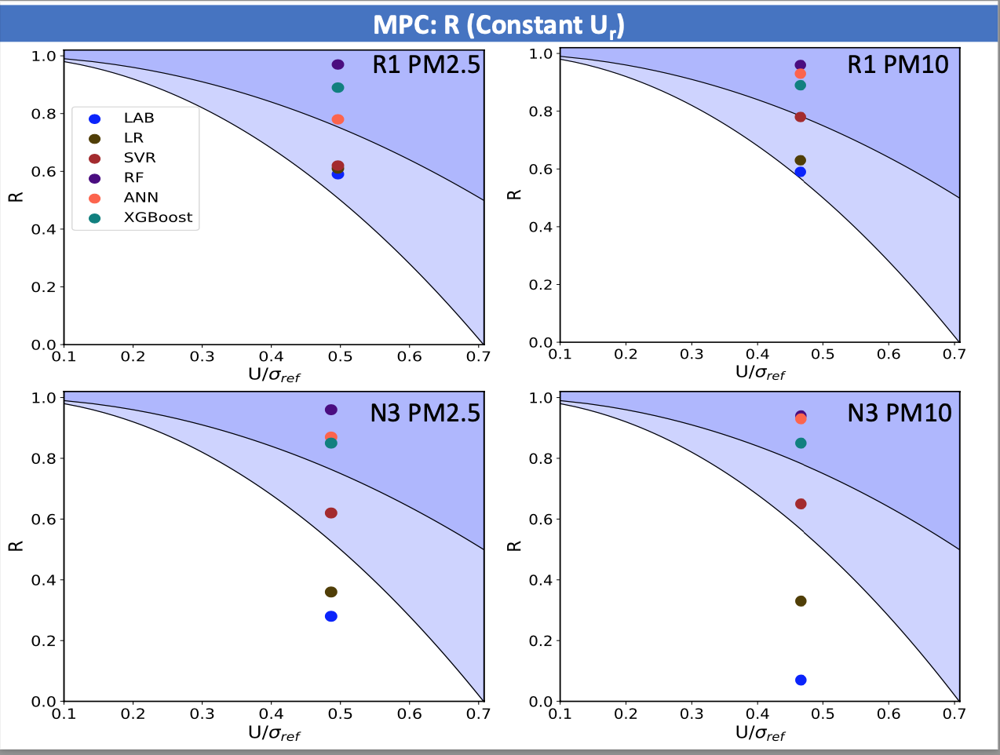
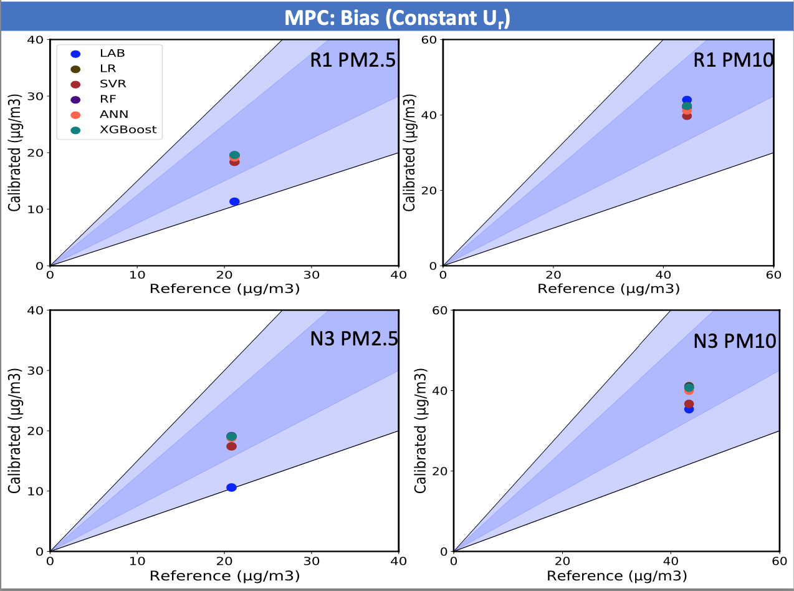
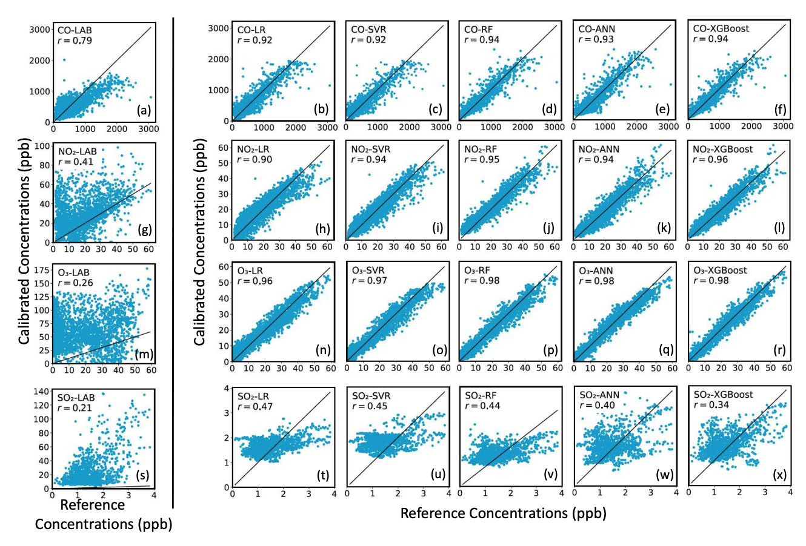
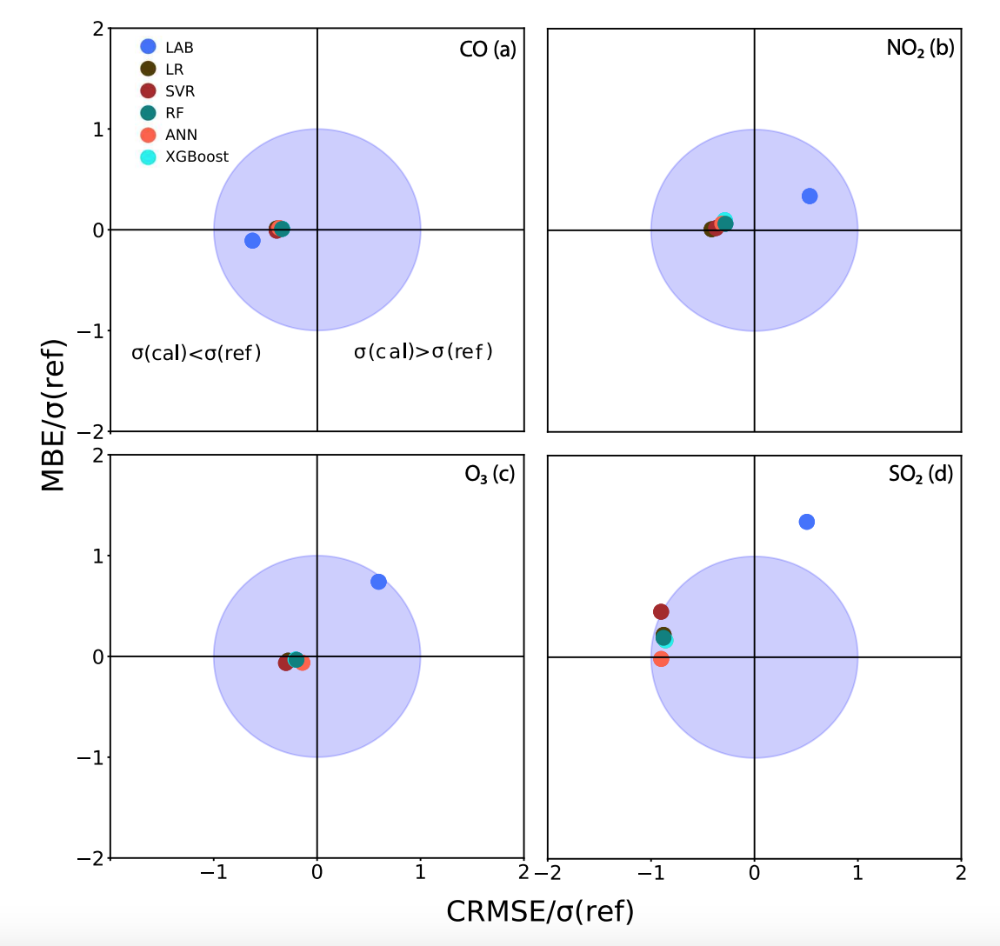
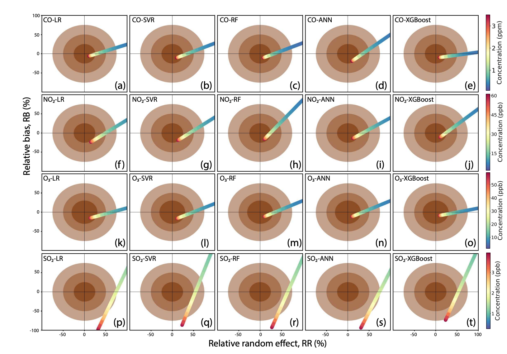
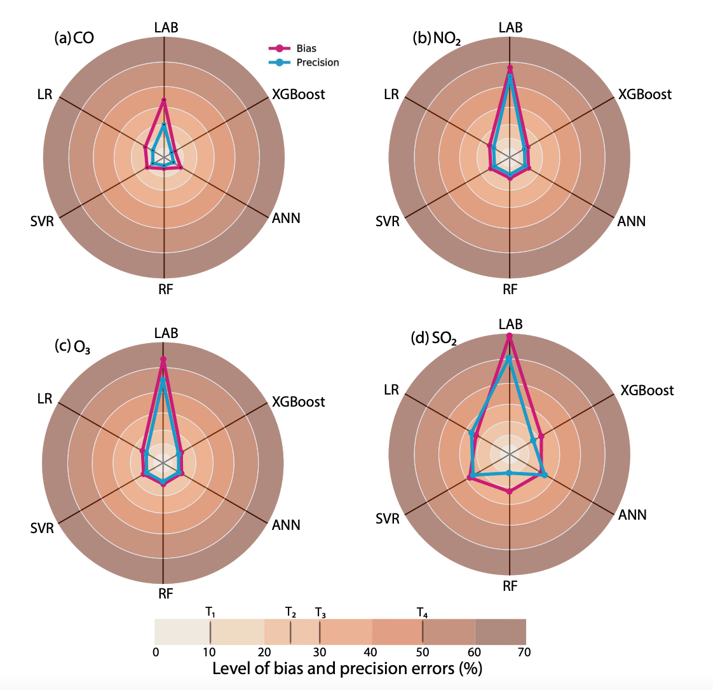
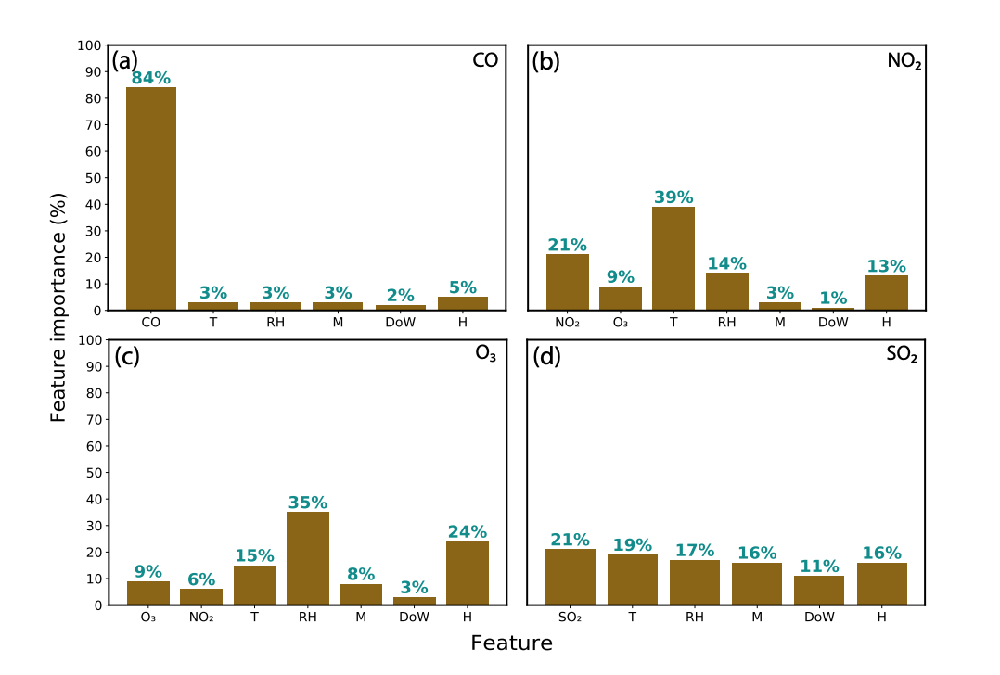
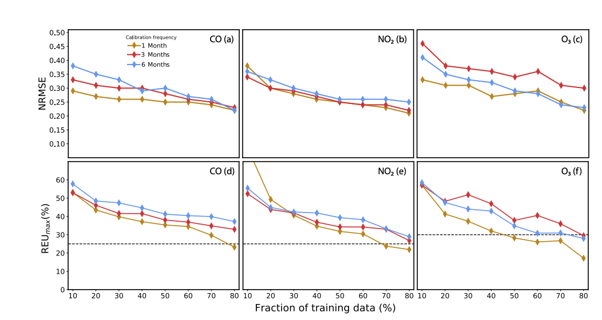

# Sensor Calibration and Air Quality Monitoring in Nicosia, Cyprus

> A comprehensive study applying advanced machine learning techniques for the calibration of low-cost gas sensors used in urban air quality monitoring in Nicosia, Cyprus.

---

## 📍 Introduction

Air pollution remains one of the most critical environmental and public health challenges of the 21st century. Exposure to elevated concentrations of pollutants such as carbon monoxide (CO), nitrogen dioxide (NO₂), ozone (O₃), and sulfur dioxide (SO₂) is linked to respiratory diseases, cardiovascular issues, and premature mortality.

Traditionally, air quality is monitored through reference-grade analyzers that provide highly accurate measurements conforming to international standards. However, these instruments are prohibitively expensive, require complex maintenance, and are sparsely deployed, leading to insufficient spatial coverage.

Low-cost sensors (LCSs) based on electrochemical principles present a promising solution for enhancing the spatio-temporal resolution of air quality data. Nonetheless, they suffer from limitations such as:
- Signal drift over time,
- Cross-sensitivity to other gases,
- Environmental influences like temperature and humidity,
- Non-linear responses across pollutant concentration ranges.

Consequently, raw outputs from LCSs often fall short of the data quality requirements for regulatory applications. Calibration, particularly through machine learning (ML) models, has emerged as a key approach to address these deficiencies by mapping raw sensor outputs to reference-grade measurements.

This project evaluates the performance of five ML algorithms in calibrating electrochemical LCSs under real-world urban conditions and assesses whether their outputs can meet European Union (EU) and United States Environmental Protection Agency (EPA) data quality objectives (DQOs).

---

## 🎯 Project Objectives

The objectives of the project are multifaceted:

- Evaluate the initial performance of LCSs using laboratory calibrations under field conditions.
- Apply and compare machine learning models (LR, SVR, RF, ANN, XGBoost) for in-situ sensor calibration.
- Analyze the impact of data sampling strategies and calibration frequencies on model effectiveness.
- Investigate how much training data is necessary for achieving regulatory compliance.
- Assess whether post-calibration outputs meet the standards stipulated in EU Directive 2008/50/EC and US EPA guidelines.
- Explore the feature importance of variables such as temperature, humidity, and cross-sensitivities.

---

## 🛠️ Experimental Setup

Measurements were collected from an urban roadside monitoring station at Strovolou Avenue, Nicosia, Cyprus.



Key elements of the experimental setup include:

- **Sensors**: Alphasense electrochemical sensors for CO, NO₂, O₃, and SO₂.
- **Reference Instruments**: Regulatory-grade analyzers operated by the Cyprus Department of Labour and Inspection.
- **Auxiliary Sensors**: Measurements of temperature and relative humidity (RH).
- **Temporal Resolution**: 
  - LCSs recorded signals every 2 seconds, aggregated into 2-minute averages.
  - Reference instruments reported 2-minute concentrations.
- **Study Period**: October 2019 to March 2020 (6 months).
  

The site experienced Mediterranean climatic conditions with variable temperature and humidity, posing real-world environmental challenges for sensor calibration.

---

## 📂 Data Sources and Preprocessing

The dataset comprised:

- **Raw Sensor Signals**: Working and auxiliary electrode voltages.
- **Reference Measurements**: Pollutant concentrations from certified analyzers.
- **Meteorological Data**: Ambient temperature and relative humidity.

**Preprocessing Steps**:
- Removal of erroneous data points (e.g., negative voltages, missing values).
- Calculation of Net Sensor Signals (NSS) by subtracting auxiliary from working electrode outputs.
- Feature Engineering:
  - Time features: month, weekday, hour.
  - Environmental features: temperature, RH.
  - Cross-sensitivity corrections: including other pollutant signals as inputs (e.g., NO₂ when calibrating O₃).

Data was then normalized and split into training and testing subsets using an 80/20 ratio.

---

## 🤖 Machine Learning Models Applied

Five different ML algorithms were evaluated:

### Linear Regression (LR)
A simple baseline model that assumes a linear relationship between input features and target pollutant concentrations.

### Support Vector Regression (SVR)
A kernel-based model capable of modeling non-linear dependencies by transforming the feature space.

### Random Forest Regression (RF)
An ensemble of decision trees that averages multiple predictions to minimize overfitting and variance, particularly robust for complex, noisy datasets.

### Artificial Neural Networks (ANN)
Deep learning models consisting of interconnected neurons arranged in layers, capable of capturing intricate non-linear relationships between inputs and outputs.

### Extreme Gradient Boosting (XGBoost)
An optimized version of gradient-boosted trees, known for its high predictive power and efficiency on structured datasets.

All models incorporated auxiliary features like temperature and RH, critical for correcting environmental interferences affecting sensor signals.

Hyperparameter optimization was conducted through a combination of grid search and AutoML techniques (Microsoft FLAML).

---

## 📏 Evaluation Metrics

Model performance was evaluated through:

- **Pearson Correlation Coefficient (r)**: Measures the linear relationship between predictions and reference measurements.
- **Coefficient of Determination (R²)**: Indicates the proportion of variance explained by the model.
- **Normalized Root Mean Squared Error (NRMSE)**: Assesses prediction errors relative to the mean reference value.
- **Relative Expanded Uncertainty (REU)**: Compliance metric based on the EU and US EPA standards.

EU Directive 2008/50/EC sets DQOs requiring REU < 25% for CO, NO₂, and SO₂, and < 30% for O₃ measurements.

---

# 📈 Results and Discussion

---

## 1. Baseline Performance of Low-Cost Sensors Versus Reference Measurements

Before applying any machine learning calibration, the raw outputs from the low-cost sensors (LCSs) were compared directly against co-located reference instruments. Statistical analyses including Shapiro-Wilk normality tests, t-tests for mean differences, and Fligner-Killeen variance tests were performed to assess the nature of discrepancies between sensor and reference data. It was found that the raw LCS signals exhibited significant deviations from the reference measurements across all target pollutants, particularly for SO₂. This highlighted the necessity of calibration even before considering operational deployment.


The discrepancies between LCS and reference measurements were attributed to a combination of sensor-specific limitations. Signal drift over time, cross-sensitivities to interfering gases, and environmental influences like temperature and relative humidity played substantial roles. Particularly for gases like NO₂ and O₃, cross-sensitivity effects were significant and worsened sensor performance. Moreover, SO₂ measurements were consistently poor, likely because ambient SO₂ concentrations during the measurement period were close to or below the detection limit of the electrochemical sensors.



These baseline results strongly justified the need for machine learning-based calibration. Without effective correction strategies, the raw LCS outputs could not be considered reliable for even non-regulatory monitoring purposes. Furthermore, these findings provided a realistic benchmark against which the effectiveness of different machine learning models could later be assessed.

---

## 2. Machine Learning Calibration Performance Overview

After applying machine learning calibration techniques, substantial improvements were observed across all sensors, except for SO₂. Post-calibration, the Pearson correlation coefficients (r) exceeded 0.9 for CO, NO₂, and O₃, indicating a very strong linear relationship between the calibrated sensor outputs and the reference-grade measurements. This substantial gain in correlation demonstrates that ML models were highly effective in correcting for the non-linearities, environmental biases, and cross-sensitivities inherent in the raw sensor data.



Random Forest (RF) consistently delivered the best calibration results across pollutants, outperforming ANN, XGBoost, SVR, and Linear Regression. RF’s superior performance can be attributed to its ensemble nature, which averages multiple decision trees and thus captures non-linear patterns without overfitting. While ANN and XGBoost also performed strongly, RF models were found to be more robust, especially under varying environmental conditions.

SO₂ calibration, however, remained problematic even after ML correction. Despite model efforts, SO₂ sensors did not achieve significant improvement because ambient concentrations were too low for the sensors to provide reliable readings. This underscores a key limitation in using electrochemical LCSs for gases present at very low ambient levels: when concentrations are close to the sensor's detection threshold, even sophisticated machine learning models cannot fully overcome the fundamental limitations of the sensor hardware.

---

## 3. Bias and Variance Analysis Through Target Diagrams

Target diagrams were used to decompose model errors into bias and variance components, providing deeper insights into calibration performance. For CO, NO₂, and O₃, machine learning models—particularly RF—successfully reduced both bias and variance compared to laboratory calibration baselines. In contrast, LAB calibrations showed systematic positive biases for NO₂ and O₃, reflecting consistent overestimations relative to the reference measurements. This highlights one of the critical weaknesses of laboratory-based calibration when applied to field conditions: lack of adaptability to environmental and cross-sensitivity effects.



For CO sensors, RF models achieved near-zero bias and very low normalized RMSE (nRMSE), confirming that calibration models effectively corrected both systematic and random errors. The situation was similar for NO₂ and O₃, albeit with slightly higher nRMSE values due to more pronounced environmental dependencies. Importantly, all ML-calibrated points fell within the unit circle of the target diagrams, implying that the models did not exhibit signs of overfitting and generalized well to unseen data.

In the case of SO₂, none of the models, including RF, managed to reduce bias or variance significantly. The high nRMSE and biases observed even after calibration suggest that environmental factors and low ambient SO₂ concentrations overwhelmed the predictive capabilities of the models. This finding reinforces that ML calibration is not a panacea—sensor limitations at very low pollutant levels impose fundamental constraints that even advanced algorithms cannot fully overcome.

---

## 4. Compliance with EU Directive 2008/50/EC and US EPA Standards

Evaluating compliance against the EU DQOs revealed that ML-calibrated CO, NO₂, and O₃ measurements successfully met the thresholds required for indicative monitoring. RF models, in particular, demonstrated relative expanded uncertainties (REUs) well below the 25% and 30% limits stipulated by EU Directive 2008/50/EC. This marks a significant achievement, indicating that with proper calibration, low-cost sensors can contribute meaningful data for non-regulatory urban air quality monitoring networks.



SO₂ calibration, however, failed to meet the DQOs under any model. The primary reasons include the sensor's poor signal-to-noise ratio at ambient concentrations and possible cross-sensitivities not adequately corrected even with advanced modeling. Thus, while ML techniques can greatly enhance LCS performance for certain pollutants, gas-specific limitations must be considered when planning sensor deployments.



US EPA DQO evaluations using precision and bias thresholds confirmed similar trends. ML models met the less stringent non-regulatory thresholds (25–30% errors) for CO, NO₂, and O₃, making them suitable for applications like citizen science, community monitoring, and hotspot identification. However, none of the sensors achieved the <10% precision and bias errors necessary for regulatory enforcement purposes. This reinforces the current positioning of LCS networks as complementary, rather than primary, air quality monitoring solutions.

---

## 5. Feature Sensitivity and Variable Importance


Random Forest feature importance analysis provided critical insights into what factors most influenced sensor calibration performance. For CO sensors, the Net Sensor Signal (NSS) was overwhelmingly the most important feature, indicating that CO LCS outputs were relatively unaffected by environmental variables or cross-sensitivities. This explains why CO sensors showed good baseline performance even before machine learning calibration.



In contrast, calibrations for NO₂ and O₃ depended heavily on temperature, relative humidity, and cross-sensitivities to other gases. Including auxiliary variables as features improved calibration R² scores by up to 9%, emphasizing that environmental compensation is essential for accurate modeling. Notably, NO₂ calibration benefited significantly from the inclusion of O₃ measurements as an input feature, and vice versa, underscoring the value of accounting for cross-sensitivities in calibration workflows.

For SO₂, no dominant feature emerged. Both environmental variables and cross-sensitivities contributed inconsistently, which partially explains the persistent poor performance of SO₂ calibration models. Overall, this feature sensitivity analysis informs future sensor network designs: robust auxiliary sensing (e.g., temperature, RH) is essential for improving calibration accuracy.

---

## 6. Effect of Training Data Volume and Calibration Frequency

An analysis of training data requirements showed that increasing the fraction of available data improved model performance, but gains plateaued beyond a certain point (around 70%). Monthly calibration cycles consistently outperformed 3- or 6-month intervals, primarily because they minimized the effects of seasonal drift and sensor aging, which degrade model accuracy over time if not periodically corrected.



Moreover, employing an interceptive sampling strategy—selecting samples across the full range of conditions rather than just temporally contiguous data—greatly reduced the amount of training data needed. In some cases, using only 22% of available data was sufficient to maintain performance comparable to models trained on 80% or more data. This has profound implications for deployment costs: co-location periods with reference stations can be dramatically shortened without sacrificing calibration quality.

These findings underscore the importance of not only model selection but also intelligent data acquisition strategies in real-world LCS deployments. By optimizing both, operators can achieve high-quality monitoring while minimizing operational and logistical burdens.

---

# 📋 Conclusion

Machine learning, particularly Random Forest models, has demonstrated the capability to calibrate low-cost air quality sensors to near-regulatory standards under real-world conditions. While not all pollutants (specifically SO₂) could be reliably corrected due to hardware detection limits, CO, NO₂, and O₃ measurements were significantly improved, achieving European Union and US EPA indicative monitoring thresholds. By optimizing calibration frequency and training data strategies, deployment costs can be substantially reduced, making dense LCS networks feasible for cities aiming to expand their air quality surveillance capabilities.

---

# 📂 Project Structure

```bash
Sensor-Calibration-AirQuality-Nicosia/
├── data/                # Raw and processed datasets
├── figures/             # All visualizations (fig1.png to fig11.png)
├── notebooks/           # Analysis Jupyter Notebooks
├── src/                 # Calibration model scripts
├── README.md            # This documentation
└── requirements.txt     # Environment dependencies
