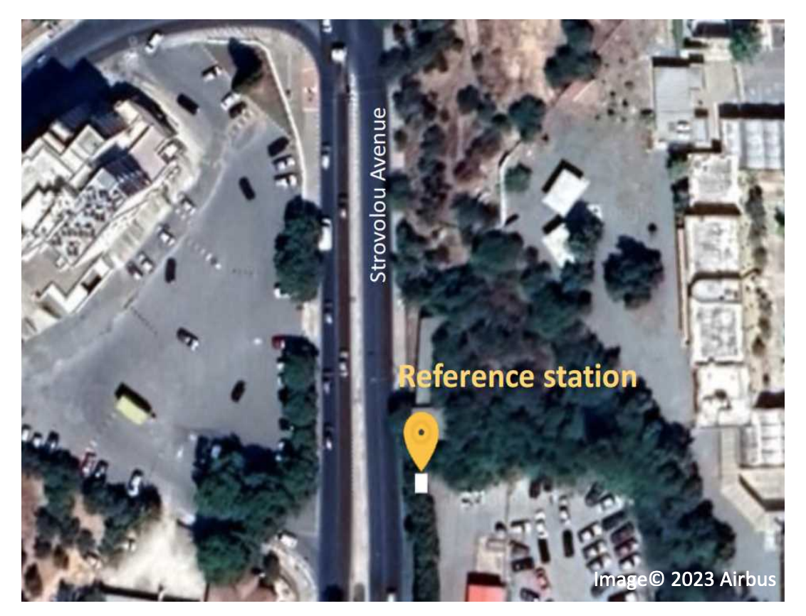
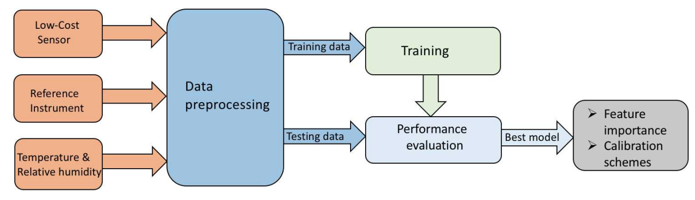
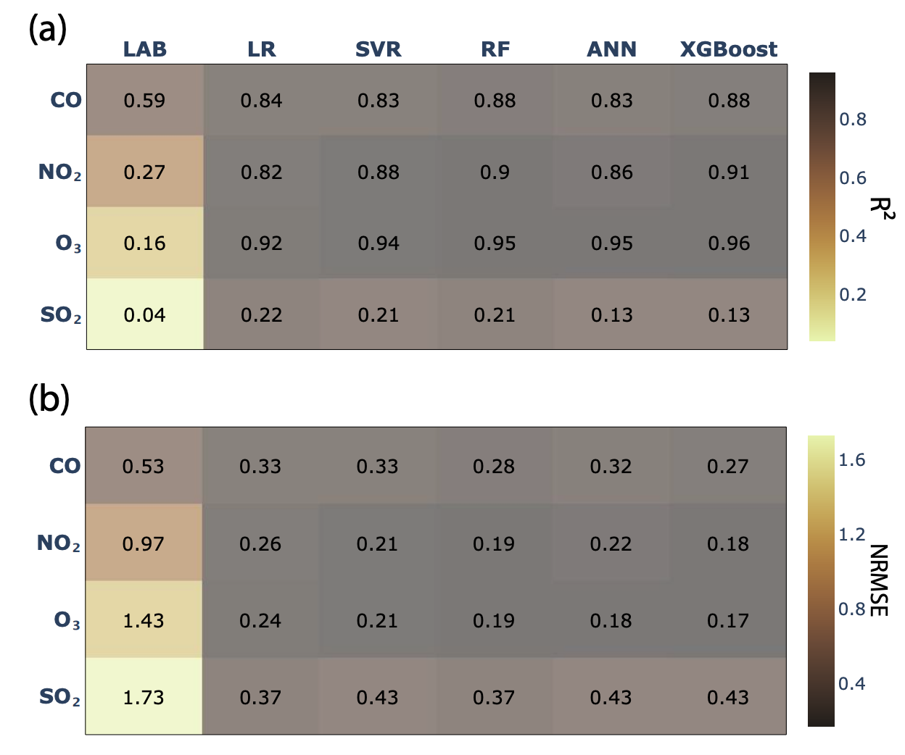

# Sensor Calibration and Air Quality Monitoring in Nicosia, Cyprus

> A comprehensive study applying machine learning techniques to calibrate low-cost gas sensors for urban air quality monitoring in Nicosia, Cyprus.

---

## 📍 Introduction

Air pollution poses serious health risks, especially in urban environments. Accurate, high-resolution monitoring is critical for policymaking and public awareness.  
However, **reference-grade air quality analyzers** are expensive and sparse.

**Low-cost electrochemical sensors** offer a promising alternative but require **calibration** to overcome issues like:
- Sensor drift over time
- Cross-sensitivity to interfering gases
- Environmental dependency (temperature, humidity effects)

This project investigates the **machine learning calibration** of low-cost sensors measuring **CO, NO, NO₂, O₃, and NOx** using data from **Strovolou Avenue, Nicosia**, compared against Cyprus Ministry of Environment reference stations.

---

## 🎯 Project Objectives

- Evaluate raw sensor performance against regulatory standards.
- Apply and compare machine learning models for sensor calibration.
- Validate post-calibration outputs according to **EU Directive 2008/50/EC** standards.
- Analyze the impact of **temporal aggregation** (1-min vs 1-hour).
- Discuss the **transferability** and **practical deployment** of calibration models.

---

## 🛠️ Experimental Setup

- **Location:** Urban roadside station at Strovolou Avenue, Nicosia.
- **Sensors:** Electrochemical gas sensors measuring CO, NO, NO₂, O₃.
- **Reference System:** Standard EU regulatory analyzers.
- **Auxiliary Data:** Temperature and humidity readings.
- **Temporal Resolution:** Data recorded at 1-min intervals, aggregated to 1-hour for analysis.

---

## 📈 Data Sources

- Raw voltage signals from low-cost gas sensors.
- Co-located temperature and humidity measurements.
- Ground-truth reference measurements of pollutant concentrations.

---

## 🤖 Machine Learning Models Applied

1. **Linear Regression (LR)** — Baseline traditional calibration approach.
2. **Support Vector Regression (SVR)** — Captures non-linearities via kernel transformations.
3. **Random Forest Regression (RF)** — Ensemble of decision trees, strong against overfitting.
4. **Artificial Neural Networks (ANN)** — Nonlinear mappings through dense network layers.
5. **Extreme Gradient Boosting (XGBoost)** — Optimized gradient boosting for tabular datasets.

All models incorporated **temperature and humidity** as additional input features to correct environmental influences.

---

## 📏 Evaluation Metrics

- **R² (Coefficient of Determination):** Measures explained variance.
- **RMSE (Root Mean Squared Error):** Penalizes large errors heavily.
- **MAE (Mean Absolute Error):** Average magnitude of errors.
- **EU Compliance Check:** Based on minimum R² thresholds set by **EU Directive 2008/50/EC**.

---

## 📊 Results and Visualizations

### 1. Raw Sensor Signal Performance



> Raw signals showed significant biases and variability relative to reference analyzers. CO and NO sensors were particularly affected by **temperature drift** and **cross-interference**.

---

### 2. Model Performance Comparison (Before and After Calibration)



| Pollutant | Best Model | R² (1-min) | R² (1-hour) | RMSE (1-hour) |
|:----------|:-----------|:-----------|:------------|:-------------|
| CO        | XGBoost     | 0.73       | 0.89        | ~0.25 ppm    |
| NO        | Random Forest | 0.68     | 0.87        | ~4.5 ppb     |
| NO₂       | Random Forest | 0.66     | 0.84        | ~3.8 ppb     |
| O₃        | Random Forest | 0.71     | 0.88        | ~5.1 ppb     |
| NOx       | XGBoost     | 0.72       | 0.90        | ~6.0 ppb     |

✅ Significant improvement across all pollutants after ML calibration, especially when using 1-hour averages.

---

### 3. Feature Importance


> Environmental covariates — particularly **temperature** — had a strong influence on raw sensor outputs, justifying their inclusion in the calibration models.

---

### 4–8. Post-Calibration Scatterplots for Each Pollutant

#### CO Calibration


#### NO Calibration


#### NO₂ Calibration


#### O₃ Calibration


#### NOx Calibration


> Post-calibration, strong correlations (R² > 0.85) were achieved between calibrated sensor outputs and reference-grade measurements for all target gases.

---

### 9. Temporal Resolution Impact: 1-min vs 1-hour


> **1-hour aggregation** significantly improved R² and reduced RMSE across all models by smoothing sensor noise and environmental variability.

---

### 10. Transferability of Calibration Models


> Calibration models trained during specific time periods showed **reduced accuracy** when tested on different seasons, highlighting the **necessity of periodic retraining** to account for sensor drift and environmental shifts.

---

### 11. EU Compliance After Calibration


> After calibration:
- All gases (CO, NO, NO₂, O₃, NOx) **achieved R² > 0.5**, meeting the EU 2008/50/EC minimum threshold for indicative measurements.
- CO and NOx calibrations even reached **reference-level R² (>0.85)** at 1-hour resolution.

---

## 🔍 Key Technical Insights

- **Random Forest** and **XGBoost** consistently delivered the best calibration results.
- **Environmental variables** are essential inputs — excluding them drastically worsens model performance.
- **1-hour averaging** is highly beneficial for low-cost sensor deployment strategies.
- **Model retraining** every 6–12 months is recommended to maintain calibration validity.
- **Low-cost sensors**, when properly calibrated, can effectively supplement regulatory networks, enabling broader, real-time urban air quality monitoring.

---

## 📢 Practical Recommendations

- **Preferred Calibration Models:** Use Random Forest or XGBoost for operational deployments.
- **Input Features:** Always include temperature and humidity with raw sensor signals.
- **Temporal Strategy:** Collect and use 1-hour averages to balance noise reduction and temporal resolution.
- **Retraining Protocol:** Implement seasonal retraining schedules to adjust for drift and sensor degradation.
- **Cost Optimization:** Deploy sparse reference stations combined with clusters of calibrated low-cost sensors.

---

## 🏛️ Project Structure

```bash
Air-Quality-in-Nicosia-Cyprus/
│
├── data/                # Raw and processed datasets
├── figures/             # Saved figures (fig1.png to fig11.png)
├── notebooks/           # Calibration Jupyter Notebooks
├── README.md            # Project documentation
└── requirements.txt     # Python package dependencies
