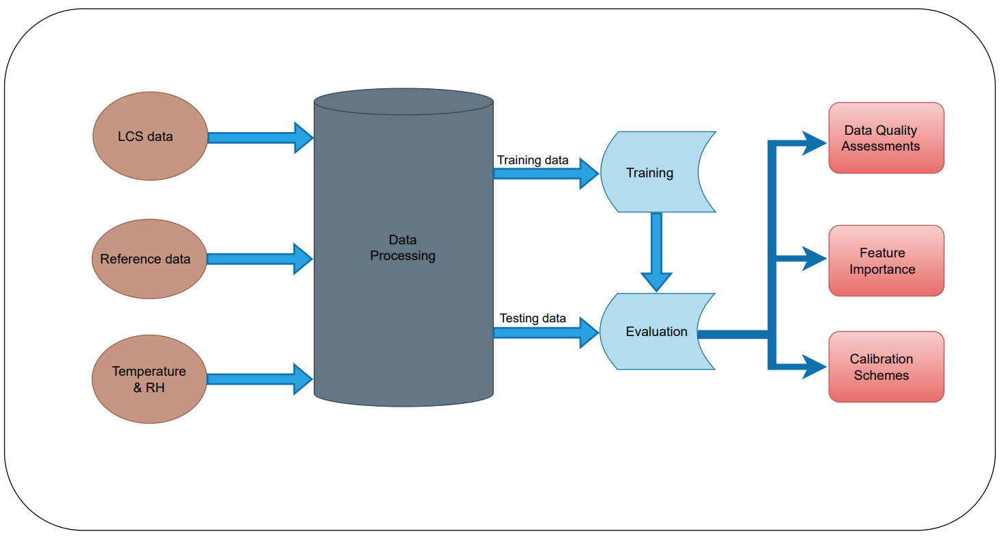
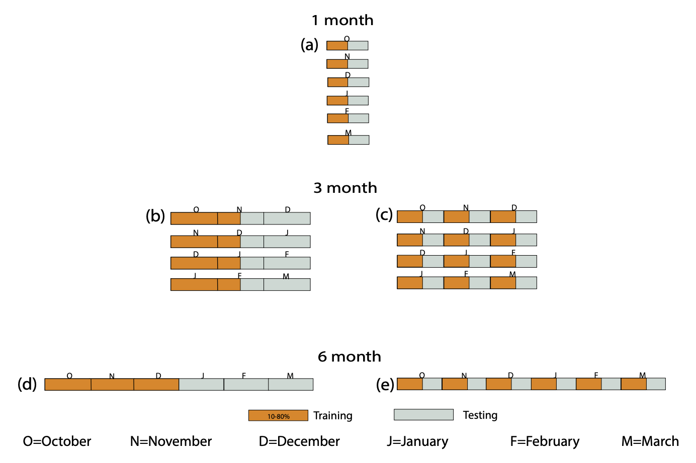
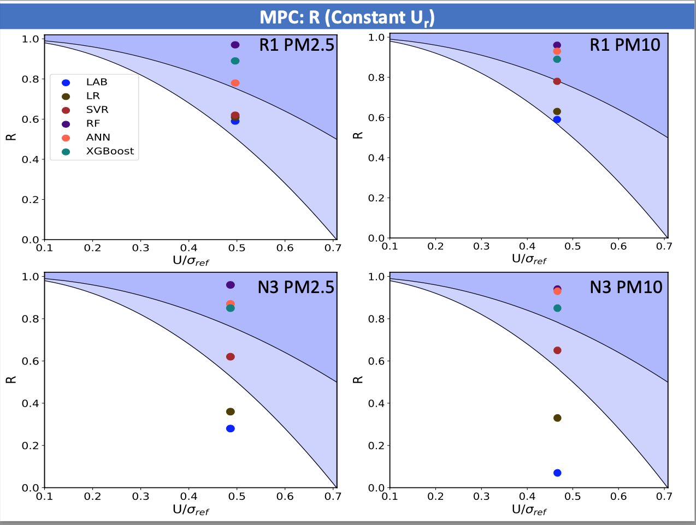
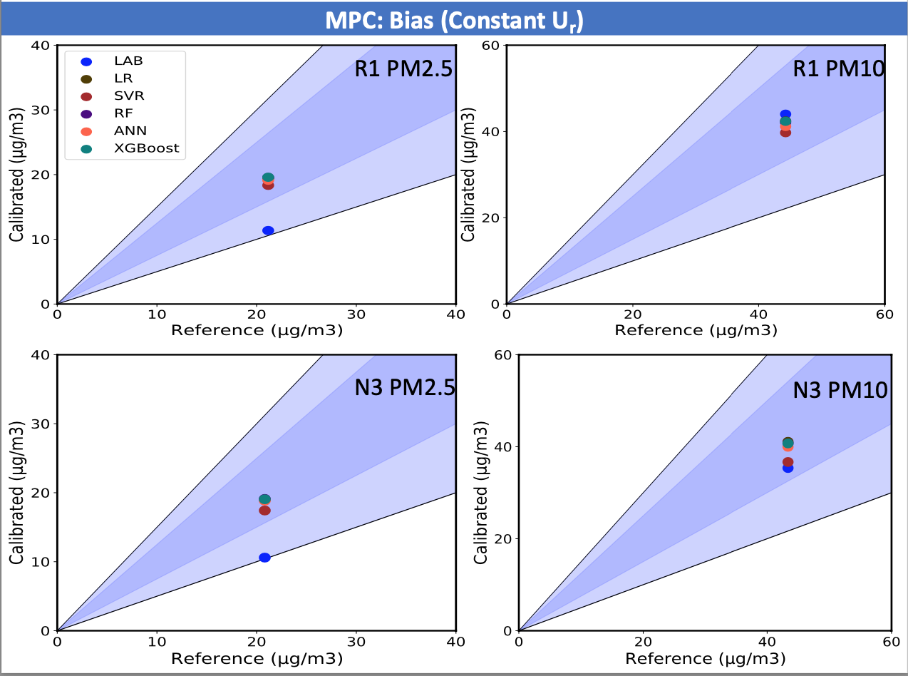
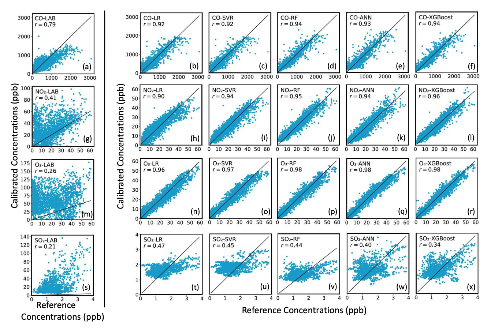
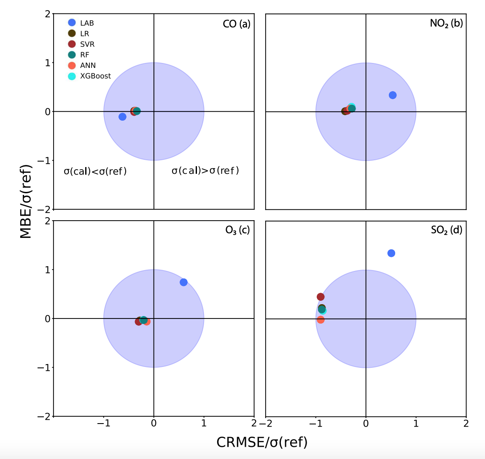
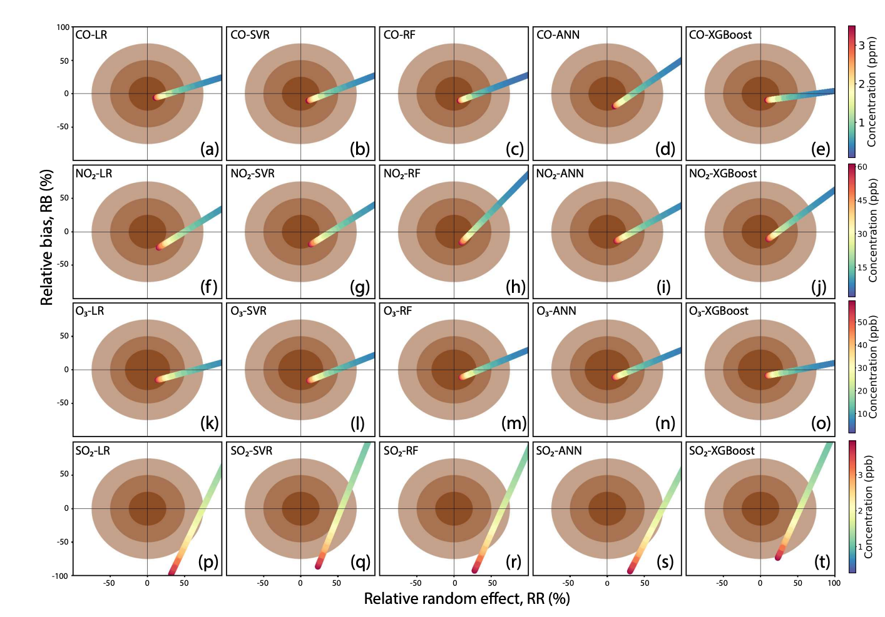
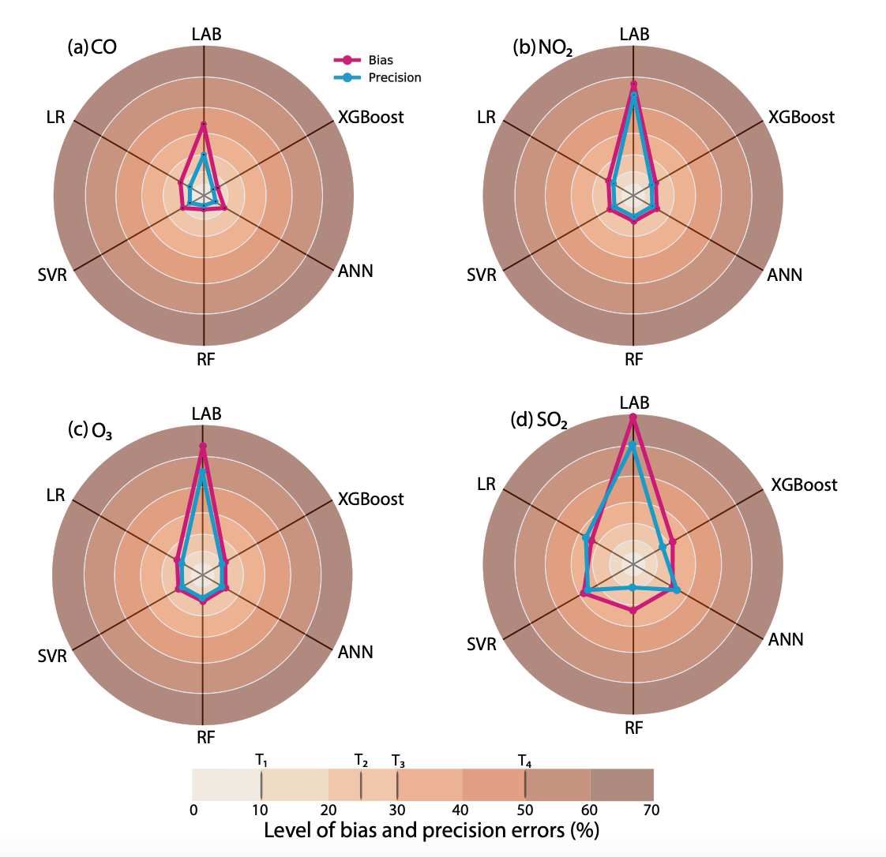
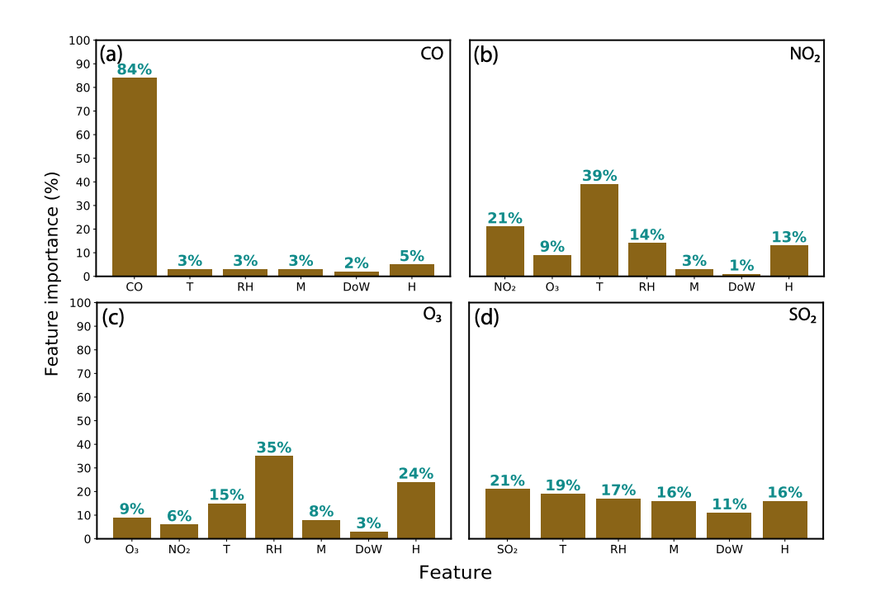
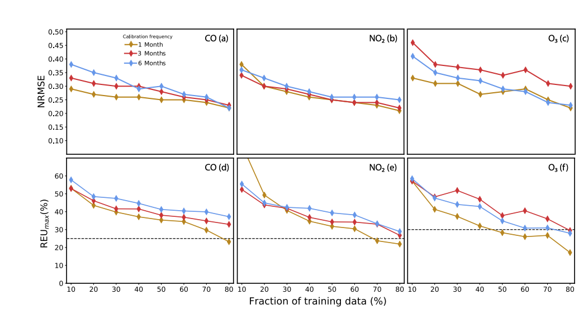

# Sensor Calibration and Air Quality Monitoring in Nicosia, Cyprus

>This study presents a comprehensive application of advanced machine learning (ML) techniques to calibrate low-cost gas sensors (LCSs) used in urban air quality monitoring in Nicosia, Cyprus. While LCSs are cost-effective and enhance the spatial and temporal resolution of air quality networks, their performance is often degraded by environmental factors such as temperature, humidity, and cross-sensitivities to non-target gases. To address these challenges, several ML algorithms were evaluated for calibrating LCS measurements of CO, NO₂, O₃, and SO₂ against reference instruments, with Random Forest emerging as the most effective model. The study further analyzed the impact of temporal resolution on calibration performance, revealing up to 21% improvement when using higher resolution data. Additionally, it explored the minimum amount of training data needed to maintain calibration quality under different calibration frequencies. Results showed that with strategic data sampling and retrospective calibration, the required training data could be reduced to as little as 22%, while still meeting the EU’s criteria for indicative measurements. These findings demonstrate that ML calibration significantly enhances LCS reliability, supporting their wider adoption in air quality monitoring applications.

## 📍 Introduction

Air pollution remains one of the most pressing environmental and public health challenges of the 21st century. Exposure to elevated levels of air pollutants such as carbon monoxide (CO), nitrogen dioxide (NO₂), ozone (O₃), and sulfur dioxide (SO₂) has been consistently linked to respiratory illnesses, cardiovascular conditions, and increased rates of premature mortality. As a result, continuous and accurate monitoring of air quality is essential for public health protection and environmental policy enforcement.

Traditionally, air quality monitoring is carried out using reference-grade analyzers at designated observational stations. These instruments offer highly precise and reliable measurements that conform to international standards, making them suitable for regulatory applications. However, their high installation and maintenance costs limit their widespread deployment, leading to sparse spatial coverage—especially in urban areas where pollution exposure is highly localized and variable.

To address the limitations of conventional monitoring networks, the scientific community has increasingly turned to low-cost sensors (LCSs), particularly those based on electrochemical principles. These sensors offer a promising means to enhance the spatial and temporal resolution of air quality monitoring systems at a fraction of the cost. Their affordability, ease of use, and portability have made them attractive not only for institutional monitoring but also for personal and community-level air quality assessments.

Despite their advantages, LCSs face a number of performance challenges that hinder their use in regulatory and high-precision monitoring. Key issues include signal drift over time, sensitivity to temperature and humidity fluctuations, cross-interference from non-target gases, and non-linear response patterns across different pollutant concentration ranges. These limitations often result in significant deviations from reference-grade instrument readings, particularly when LCSs are used in uncontrolled real-world environments.

To mitigate these shortcomings, post-deployment calibration has become a central strategy, with machine learning (ML) models emerging as a particularly effective solution. Unlike traditional calibration methods, ML algorithms can account for complex, non-linear relationships between raw sensor readings and environmental conditions, enabling more accurate mapping to reference-grade values. This approach typically requires the colocation of LCSs and reference instruments over a defined period to gather training data that reflects real-world variability.

In this project, we evaluate the performance of five ML algorithms—Linear Regression (LR), Support Vector Regression (SVR), Random Forest (RF), Artificial Neural Networks (ANN), and Extreme Gradient Boosting (XGBoost)—in calibrating LCS data collected over six months at a traffic monitoring station in Nicosia, Cyprus. The study investigates not only the predictive accuracy of each algorithm but also the influence of practical factors such as the temporal resolution of the data, sampling strategy, and calibration frequency. A key focus is on determining the minimum data requirements for training while still achieving data quality objectives (DQOs) as defined by the European Union (EU) and the United States Environmental Protection Agency (EPA), thus evaluating whether calibrated LCSs can serve as reliable tools for indicative air quality monitoring.


---

## 🎯 Project Objectives

The overarching goal of this project is to evaluate and improve the performance of low-cost air quality sensors (LCSs) using machine learning (ML) techniques under real-world urban conditions. The specific objectives of the study are outlined below:

### 📌 1. Evaluate Baseline Sensor Performance in the Field
Before applying any advanced calibration techniques, the study begins by assessing how LCSs—typically calibrated under controlled laboratory conditions—perform when deployed in the field. This involves comparing raw sensor outputs with co-located reference-grade measurements to understand the extent of deviations and limitations due to environmental variables such as temperature, humidity, and interfering pollutants.

###  ⚙️ 2. Apply and Compare Machine Learning Models for In-Situ Calibration
A core objective is to implement and compare the performance of five ML algorithms—Linear Regression (LR), Support Vector Regression (SVR), Random Forest (RF), Artificial Neural Networks (ANN), and Extreme Gradient Boosting (XGBoost)—for post-deployment calibration of sensor data. Each model is evaluated based on its ability to correct measurement biases and produce outputs that closely align with reference-grade instruments.

###  🔁 3. Analyze Data Sampling Strategies and Calibration Frequencies
The study examines how the choice of data sampling strategy (e.g., continuous vs. intermittent sampling) and calibration frequency (e.g., monthly, quarterly, biannually) affect the accuracy and robustness of the ML calibration models. This analysis is critical for determining cost-effective yet reliable deployment strategies for long-term sensor operation in urban air quality monitoring networks.

### 📊 4. Determine Minimum Data Requirements for Effective Calibration
Another objective is to investigate the minimum amount of training data required to build accurate and reliable ML calibration models. The aim is to strike a balance between minimizing data collection efforts and maximizing model performance, while still meeting the quality thresholds set by regulatory bodies.

###  📏 5. Assess Regulatory Compliance of Calibrated Outputs
The post-calibration outputs are evaluated against the data quality objectives (DQOs) defined in the European Union’s Ambient Air Quality Directive (2008/50/EC) and the United States Environmental Protection Agency (EPA) guidelines. Specifically, the study assesses whether the calibrated sensor data meets the criteria for "indicative measurements," which require expanded uncertainties within prescribed limits for different pollutants.

###  🧠 6. Explore Feature Importance and Environmental Influences
Finally, the study explores the relative importance of various input features—such as temperature, relative humidity, and the presence of interfering gases—in influencing sensor measurements. This analysis helps to interpret the behavior of ML models and provides insights into which variables most significantly affect the accuracy of LCSs, thus guiding future sensor design and deployment strategies.

---

## 🛠️ Experimental Setup

In this work, I employed four electrochemical sensors to measure the concentrations of carbon monoxide (CO), nitrogen dioxide (NO₂), ozone (O₃), and sulfur dioxide (SO₂). Each sensor generates two raw analog voltage signals: one from the working electrode, which responds to the target gas, and another from the auxiliary electrode, which provides a background reference signal. These voltage signals are converted into gas concentrations, expressed in parts per billion (ppb), using calibration equations provided by the manufacturer, which are based on laboratory conditions. For clarity in this analysis, these computed values are referred to as laboratory (LAB) calibrated concentrations. The measurements were conducted over a six-month period, from 2 October 2019 to 31 March 2020, at a national regulatory air quality monitoring station located in Nicosia. The station is positioned about 10 meters from a major urban avenue and is equipped with reference-grade instruments capable of measuring the same four pollutants. These instruments undergo calibration at least once every three months or after maintenance activities. The site experienced Mediterranean climatic conditions with variable temperature and humidity, posing real-world environmental challenges for sensor calibration.

The calibration of low-cost sensor (LCS) measurements using machine learning (ML) began with data preparation and synchronization. Reference instrument readings, along with temperature and relative humidity (RH) measurements from nearby sensors, were recorded at two-minute intervals, while the LCSs collected data every two seconds. To align these datasets, LCS measurements were averaged over two-minute intervals and merged with the corresponding reference values, temperature, and RH data. Data cleaning involved removing rows with missing values and those with negative net sensor signals—calculated by subtracting the auxiliary electrode signal from the working electrode signal. The cleaned dataset included as input variables: net sensor signals (NSS), temperature, RH, and temporal features such as month, day of the week, and hour. These temporal features were introduced to capture seasonal, weekly, and daily variability in pollutant levels. Additionally, due to known cross-sensitivities, reference concentrations of ozone and nitrogen dioxide were included as input features when calibrating the NO₂ and O₃ sensors, respectively.



Five ML models were employed for the calibration task: Linear Regression (LR), Support Vector Regression (SVR), Random Forest (RF), Artificial Neural Network (ANN), and Extreme Gradient Boosting (XGBoost). All model training and evaluations were conducted in Python using the Anaconda environment. The full dataset, covering six months, was split into training and testing subsets—where the first 80% of each month’s data was used for training and tuning model parameters, and the remaining 20% was used for testing. Hyperparameters for SVR and ANN were optimized through five-fold cross-validation combined with a grid search. In contrast, hyperparameter tuning for RF and XGBoost was performed using an automated machine learning library. Any remaining parameters were left at their default values to maintain consistency across models.

Following calibration, model performance was assessed using several statistical indicators. The best-performing model was then selected for further analysis to evaluate the importance of individual features in the calibration process. Additionally, this model was used to investigate the effects of varying the temporal resolution of training data, different data sampling strategies, and calibration frequency on the amount of data required for model training. Feature importance was assessed using the permutation feature importance method available within the Scikit-learn ML library, allowing a deeper understanding of which variables most influenced the accuracy of calibrated sensor outputs.

## 🛠️ Data splitting schemes
To understand how the sampling strategy of training data affects the calibration frequency and the quantity of data required for effective model training, a series of experiments were conducted using CO, NO₂, and O₃ low-cost sensors. Calibration was carried out at three different frequencies—monthly, every three months, and every six months. For the monthly calibration, training data was selected from the beginning of each month, capturing early-month conditions to inform the calibration models. This approach aimed to assess whether limited yet regularly collected data could maintain calibration accuracy over the course of each month.


  

For the three-month and six-month calibration intervals, two distinct data sampling strategies were evaluated. The first strategy involved selecting training data exclusively from the beginning of the calibration period. This method tested whether a snapshot of data at the start of the interval could be representative enough for accurate predictions throughout the entire three- or six-month period. The performance of the calibration models under this strategy would indicate the feasibility of infrequent but concentrated data collection efforts, which could be more practical for long-term deployments.

The second strategy for the longer calibration periods involved sampling training data from multiple points within the entire calibration interval—specifically at the start of each month within the three- or six-month periods. This approach was designed to explore whether spreading out the sampling effort and collecting training data more evenly over time could yield better calibration outcomes. The goal was to determine whether a more distributed dataset would improve model generalizability across variable conditions, such as seasonal or weekly fluctuations. Comparisons between the two sampling strategies provided insight into optimal practices for balancing data collection effort, calibration frequency, and model performance.

---

## 🤖 Machine Learning Models Applied

Five different ML algorithms were evaluated:

### Linear Regression (LR)
A simple baseline model that assumes a linear relationship between input features and target pollutant concentrations.

### Support Vector Regression (SVR)
A kernel-based model capable of modeling non-linear dependencies by transforming the feature space.

### Random Forest Regression (RF)
An ensemble of decision trees that averages multiple predictions to minimize overfitting and variance, particularly robust for complex, noisy datasets.

### Artificial Neural Networks (ANN)
Deep learning models consisting of interconnected neurons arranged in layers, capable of capturing intricate non-linear relationships between inputs and outputs.

### Extreme Gradient Boosting (XGBoost)
An optimized version of gradient-boosted trees, known for its high predictive power and efficiency on structured datasets.

All models incorporated auxiliary features like temperature and RH, critical for correcting environmental interferences affecting sensor signals.

Hyperparameter optimization was conducted through a combination of grid search and AutoML techniques (Microsoft FLAML).

---

## 📏 Evaluation Metrics

Model performance was evaluated using a combination of statistical metrics that assess different aspects of how well the calibration models fit the reference data. The first set of metrics includes the Pearson correlation coefficient (r), which quantifies the strength and direction of the linear relationship between the predicted (calibrated) values and the reference measurements. A high correlation indicates that the model predictions closely follow the trends in the reference data. The coefficient of determination (R²) complements this by measuring the proportion of variance in the reference data that is explained by the model. Meanwhile, the normalized root mean squared error (NRMSE) provides a normalized measure of the average prediction error, expressing how far off the calibrated values are from the reference values relative to the mean reference concentration. These metrics together give a comprehensive view of accuracy, reliability, and precision of the calibration models.

In addition to these metrics, the evaluation process also involved an analysis of bias and variance through the use of target diagrams. These diagrams help diagnose whether a model is overfitting or underfitting the data by visually separating the total error into components related to bias (systematic error) and variance (random error). Overfitting models typically show low bias but high variance, meaning they capture noise rather than underlying patterns, while underfitting models have high bias but low variance, failing to capture the true data structure. The root mean square error (RMSE) of the model is decomposed into the mean bias error (MBE), which captures systematic deviations, and the centered root mean square error (CRMSE), which captures unsystematic deviations. This decomposition enables a deeper understanding of the sources of model error and guides improvements in calibration approaches.

Finally, the evaluation incorporated compliance with data quality objectives as set by regulatory standards, particularly the European Union’s directive on air quality. This involves calculating the Relative Expanded Uncertainty (REU), a metric that combines random and systematic uncertainties to assess whether the calibrated sensor measurements meet the acceptable accuracy thresholds for indicative air quality monitoring. The REU is calculated through regression analysis that models the linear relationship between calibrated and reference concentrations, with adjustments for uncertainties in both sets of measurements. The evaluation of REU, along with precision and bias error estimators, ensures that the calibration methods not only improve statistical fit but also meet practical data quality requirements for environmental monitoring applications. This holistic assessment guarantees that the calibration models produce data that are both scientifically robust and regulatory-compliant.

---

# 📈 Results and Discussion

## 1. Baseline Performance of Low-Cost Sensors Versus Reference Measurements

Before applying any machine learning calibration, the raw outputs from the low-cost sensors (LCSs) were compared directly against co-located reference instruments. Statistical analyses including Shapiro-Wilk normality tests, t-tests for mean differences, and Fligner-Killeen variance tests were performed to assess the nature of discrepancies between sensor and reference data. It was found that the raw LCS signals exhibited significant deviations from the reference measurements across all target pollutants, particularly for SO₂. This highlighted the necessity of calibration even before considering operational deployment.


The discrepancies between LCS and reference measurements were attributed to a combination of sensor-specific limitations. Signal drift over time, cross-sensitivities to interfering gases, and environmental influences like temperature and relative humidity played substantial roles. Particularly for gases like NO₂ and O₃, cross-sensitivity effects were significant and worsened sensor performance. Moreover, SO₂ measurements were consistently poor, likely because ambient SO₂ concentrations during the measurement period were close to or below the detection limit of the electrochemical sensors.



These baseline results strongly justified the need for machine learning-based calibration. Without effective correction strategies, the raw LCS outputs could not be considered reliable for even non-regulatory monitoring purposes. Furthermore, these findings provided a realistic benchmark against which the effectiveness of different machine learning models could later be assessed.

---

## 2. Machine Learning Calibration Performance Overview

After applying machine learning calibration techniques, substantial improvements were observed across all sensors, except for SO₂. Post-calibration, the Pearson correlation coefficients (r) exceeded 0.9 for CO, NO₂, and O₃, indicating a very strong linear relationship between the calibrated sensor outputs and the reference-grade measurements. This substantial gain in correlation demonstrates that ML models were highly effective in correcting for the non-linearities, environmental biases, and cross-sensitivities inherent in the raw sensor data.



Random Forest (RF) consistently delivered the best calibration results across pollutants, outperforming ANN, XGBoost, SVR, and Linear Regression. RF’s superior performance can be attributed to its ensemble nature, which averages multiple decision trees and thus captures non-linear patterns without overfitting. While ANN and XGBoost also performed strongly, RF models were found to be more robust, especially under varying environmental conditions.

SO₂ calibration, however, remained problematic even after ML correction. Despite model efforts, SO₂ sensors did not achieve significant improvement because ambient concentrations were too low for the sensors to provide reliable readings. This underscores a key limitation in using electrochemical LCSs for gases present at very low ambient levels: when concentrations are close to the sensor's detection threshold, even sophisticated machine learning models cannot fully overcome the fundamental limitations of the sensor hardware.

---

## 3. Bias and Variance Analysis Through Target Diagrams

Target diagrams were used to decompose model errors into bias and variance components, providing deeper insights into calibration performance. For CO, NO₂, and O₃, machine learning models—particularly RF—successfully reduced both bias and variance compared to laboratory calibration baselines. In contrast, LAB calibrations showed systematic positive biases for NO₂ and O₃, reflecting consistent overestimations relative to the reference measurements. This highlights one of the critical weaknesses of laboratory-based calibration when applied to field conditions: lack of adaptability to environmental and cross-sensitivity effects.



For CO sensors, RF models achieved near-zero bias and very low normalized RMSE (nRMSE), confirming that calibration models effectively corrected both systematic and random errors. The situation was similar for NO₂ and O₃, albeit with slightly higher nRMSE values due to more pronounced environmental dependencies. Importantly, all ML-calibrated points fell within the unit circle of the target diagrams, implying that the models did not exhibit signs of overfitting and generalized well to unseen data.

In the case of SO₂, none of the models, including RF, managed to reduce bias or variance significantly. The high nRMSE and biases observed even after calibration suggest that environmental factors and low ambient SO₂ concentrations overwhelmed the predictive capabilities of the models. This finding reinforces that ML calibration is not a panacea—sensor limitations at very low pollutant levels impose fundamental constraints that even advanced algorithms cannot fully overcome.

---

## 4. Compliance with EU Directive 2008/50/EC and US EPA Standards

Evaluating compliance against the EU DQOs revealed that ML-calibrated CO, NO₂, and O₃ measurements successfully met the thresholds required for indicative monitoring. RF models, in particular, demonstrated relative expanded uncertainties (REUs) well below the 25% and 30% limits stipulated by EU Directive 2008/50/EC. This marks a significant achievement, indicating that with proper calibration, low-cost sensors can contribute meaningful data for non-regulatory urban air quality monitoring networks.



SO₂ calibration, however, failed to meet the DQOs under any model. The primary reasons include the sensor's poor signal-to-noise ratio at ambient concentrations and possible cross-sensitivities not adequately corrected even with advanced modeling. Thus, while ML techniques can greatly enhance LCS performance for certain pollutants, gas-specific limitations must be considered when planning sensor deployments.



US EPA DQO evaluations using precision and bias thresholds confirmed similar trends. ML models met the less stringent non-regulatory thresholds (25–30% errors) for CO, NO₂, and O₃, making them suitable for applications like citizen science, community monitoring, and hotspot identification. However, none of the sensors achieved the <10% precision and bias errors necessary for regulatory enforcement purposes. This reinforces the current positioning of LCS networks as complementary, rather than primary, air quality monitoring solutions.

---

## 5. Feature Sensitivity and Variable Importance


Random Forest feature importance analysis provided critical insights into what factors most influenced sensor calibration performance. For CO sensors, the Net Sensor Signal (NSS) was overwhelmingly the most important feature, indicating that CO LCS outputs were relatively unaffected by environmental variables or cross-sensitivities. This explains why CO sensors showed good baseline performance even before machine learning calibration.



In contrast, calibrations for NO₂ and O₃ depended heavily on temperature, relative humidity, and cross-sensitivities to other gases. Including auxiliary variables as features improved calibration R² scores by up to 9%, emphasizing that environmental compensation is essential for accurate modeling. Notably, NO₂ calibration benefited significantly from the inclusion of O₃ measurements as an input feature, and vice versa, underscoring the value of accounting for cross-sensitivities in calibration workflows.

For SO₂, no dominant feature emerged. Both environmental variables and cross-sensitivities contributed inconsistently, which partially explains the persistent poor performance of SO₂ calibration models. Overall, this feature sensitivity analysis informs future sensor network designs: robust auxiliary sensing (e.g., temperature, RH) is essential for improving calibration accuracy.

---

## 6. Effect of Training Data Volume and Calibration Frequency

An analysis of training data requirements showed that increasing the fraction of available data improved model performance, but gains plateaued beyond a certain point (around 70%). Monthly calibration cycles consistently outperformed 3- or 6-month intervals, primarily because they minimized the effects of seasonal drift and sensor aging, which degrade model accuracy over time if not periodically corrected.



Moreover, employing an interceptive sampling strategy—selecting samples across the full range of conditions rather than just temporally contiguous data—greatly reduced the amount of training data needed. In some cases, using only 22% of available data was sufficient to maintain performance comparable to models trained on 80% or more data. This has profound implications for deployment costs: co-location periods with reference stations can be dramatically shortened without sacrificing calibration quality.

These findings underscore the importance of not only model selection but also intelligent data acquisition strategies in real-world LCS deployments. By optimizing both, operators can achieve high-quality monitoring while minimizing operational and logistical burdens.

---

# 📋 Conclusion

Machine learning, particularly Random Forest models, has demonstrated the capability to calibrate low-cost air quality sensors to near-regulatory standards under real-world conditions. While not all pollutants (specifically SO₂) could be reliably corrected due to hardware detection limits, CO, NO₂, and O₃ measurements were significantly improved, achieving European Union and US EPA indicative monitoring thresholds. By optimizing calibration frequency and training data strategies, deployment costs can be substantially reduced, making dense LCS networks feasible for cities aiming to expand their air quality surveillance capabilities.

---

# 📂 Project Structure

```bash
Sensor-Calibration-AirQuality-Nicosia/
├── data/                # Raw and processed datasets
├── figures/             # All visualizations (fig1.png to fig11.png)
├── notebooks/           # Analysis Jupyter Notebooks
├── src/                 # Calibration model scripts
├── README.md            # This documentation
└── requirements.txt     # Environment dependencies
